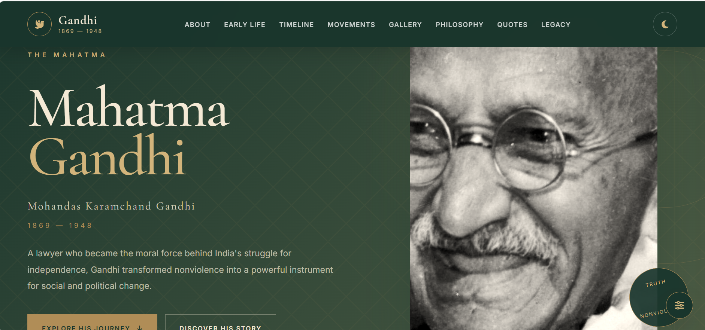
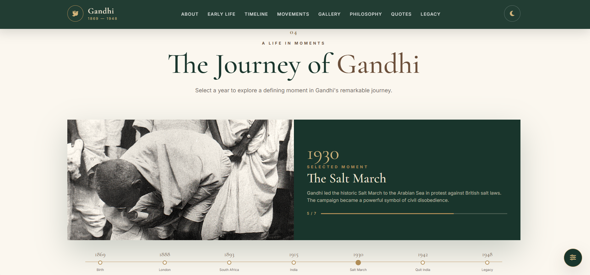
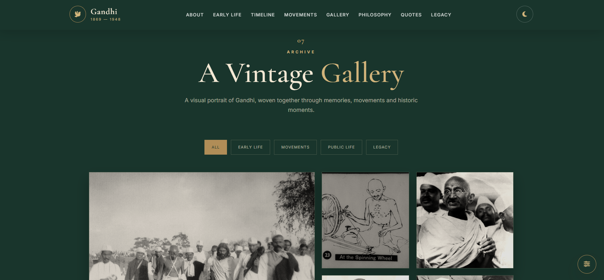
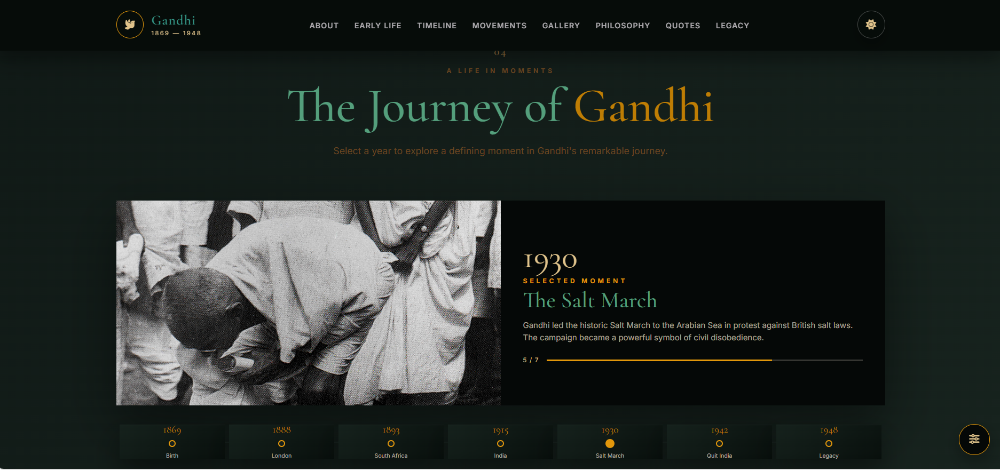
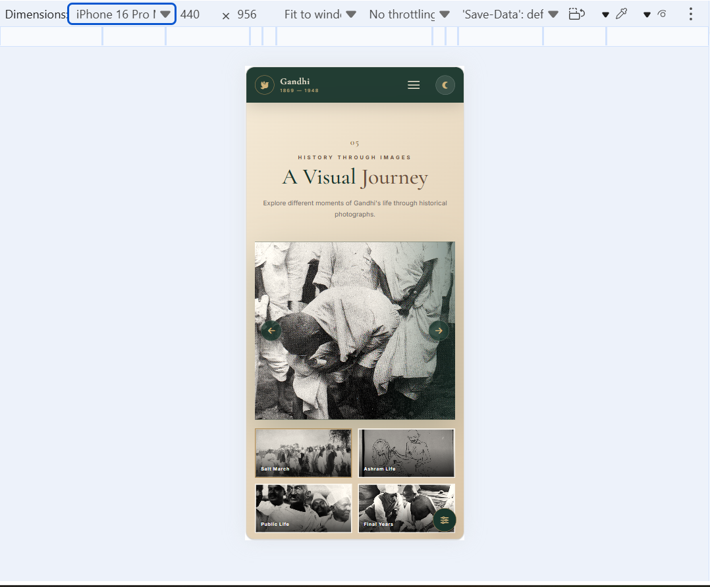

# 🕊️ Mahatma Gandhi Tribute Page

A beautiful, responsive and interactive tribute website dedicated to **Mahatma Gandhi**, one of the most influential leaders of the Indian independence movement.

This project was created as part of the **OASIS InfoByte Web Development Internship – Level 2, Task 2**.

---

## 📌 Project Overview

The Mahatma Gandhi Tribute Page presents Gandhi's life, philosophy, important events, famous quotes and lasting legacy in a modern website with a vintage and luxury visual style.

The website combines historical content with modern web design, animations, responsive layouts and JavaScript interactions.

---

## ✨ Features

- 🏠 Beautiful Hero Section
- 👤 About Mahatma Gandhi
- ⏳ Interactive Life Timeline
- 🕊️ Gandhi's Philosophy
- 🖼️ Historical Image Gallery
- 💬 Famous Gandhi Quotes
- 🌿 Gandhi's Legacy
- 🌙 Dark / Light Mode
- 📱 Fully Responsive Design
- ✨ Smooth Animations
- 🎨 Vintage + Luxury + Modern Design
- 🖱️ Interactive Gallery Filters
- 📜 Scroll-based animations
- 🔝 Smooth navigation
- 💻 Desktop, Tablet and Mobile support

---

## 🛠️ Technologies Used

- HTML5
- CSS3
- JavaScript
- CSS Grid
- CSS Flexbox
- Responsive Web Design
- Font Awesome
- Google Fonts
- Git
- GitHub

---

## 📂 Project Structure

```text
WebDev-L2-Tribute-Page/
│
├── index.html
├── style.css
├── script.js
├── README.md
│
└── screenshots/
    ├── home.png
    ├── timeline.png
    ├── gallery.png
    ├── dark-mode.png
    └── mobile.png


    ---

## 🎨 Design

The website uses a combination of historical and modern visual elements.

### Color Palette

| Color | Hex |
|---|---|
| Cream | `#F4E9D5` |
| Beige | `#D8C3A5` |
| Olive Green | `#4F5D45` |
| Dark Green | `#19352C` |
| Antique Gold | `#B08D57` |
| Brown | `#6B4F3A` |

The design uses warm historical colors combined with dark green and antique gold to create a vintage and luxurious atmosphere.

---

## 🌙 Dark Mode

The website includes a Dark Mode feature that allows users to switch between light and dark themes.

The dark theme provides a comfortable viewing experience while maintaining the visual identity of the website.

---

## 📱 Responsive Design

The website is designed to work on different screen sizes:

- 🖥️ Desktop
- 💻 Laptop
- 📱 Tablet
- 📱 Mobile

The layout automatically adapts to different screen sizes using responsive CSS techniques.

---

## ⚡ JavaScript Features

JavaScript is used to add interactive functionality to the website.

Main JavaScript features include:

- Dark / Light Mode Toggle
- Gallery Filtering
- Smooth Scrolling
- Scroll Animations
- Interactive Navigation
- Dynamic UI Effects

---

## 🖼️ Screenshots

### 🏠 Home Page



---

### ⏳ Timeline



---

### 🖼️ Gallery



---

### 🌙 Dark Mode



---

### 📱 Mobile View



---

## 🚀 How to Run the Project

1. Clone or download the repository.

2. Open the project folder:

`WebDev-L2-Tribute-Page`

3. Open `index.html` in your browser.

You can also use Visual Studio Code with the Live Server extension.

---

## 🔧 Git & Version Control

Git was used throughout the development process to manage the project and track changes.

The project contains separate commits for major development stages, including:

- HTML structure
- CSS styling
- JavaScript functionality
- Documentation
- Project screenshots

The project is hosted on GitHub.

---

## 📚 Learning Outcomes

Through this project, I practiced and improved my skills in:

- Creating semantic HTML structures
- Advanced CSS styling
- CSS Grid and Flexbox
- Responsive web design
- JavaScript DOM manipulation
- Creating interactive UI components
- Creating dark mode
- Working with image galleries
- Adding animations
- Using Git and GitHub
- Organizing a professional web project

---

## 👩‍💻 Author

**Marzia Nazami**

Web Development Student

---

## 🏆 Internship

**OASIS InfoByte**

**Web Development Internship**

**Level 2 – Task 2**

### Mahatma Gandhi Tribute Page

---

## ❤️ Acknowledgement

This project was created as part of the OASIS InfoByte Web Development Internship.

Special thanks to OASIS InfoByte for providing the opportunity to practice and improve web development skills through practical projects.

---

## 📄 License

This project was created for educational and internship purposes.